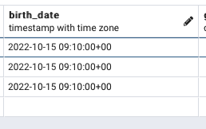

# Timestamp

## Timestamp with timezone

- Postgresql에서 `timestamp` 컬럼을 `with time zone`으로 생성하면 저장하는 데이트가 utc로 저장된다.
- 다음과 같이 3개의 시간대로 저장한다면
```go
	// UTC
    birthStr1 := "2022-10-15T09:10:00+00:00"
    // KST
	birthStr2 := "2022-10-15T18:10:00+09:00"
    // EDT
	birthStr3 := "2022-10-15T05:10:00-04:00"

```

```go	
    birthDate, _ := time.Parse(time.RFC3339, birthStr)
```

- 다음과 같이 모든 시간대가 UTC 기준시로 저장되는 것을 확인할 수 있다.

## Timestamp without timezone